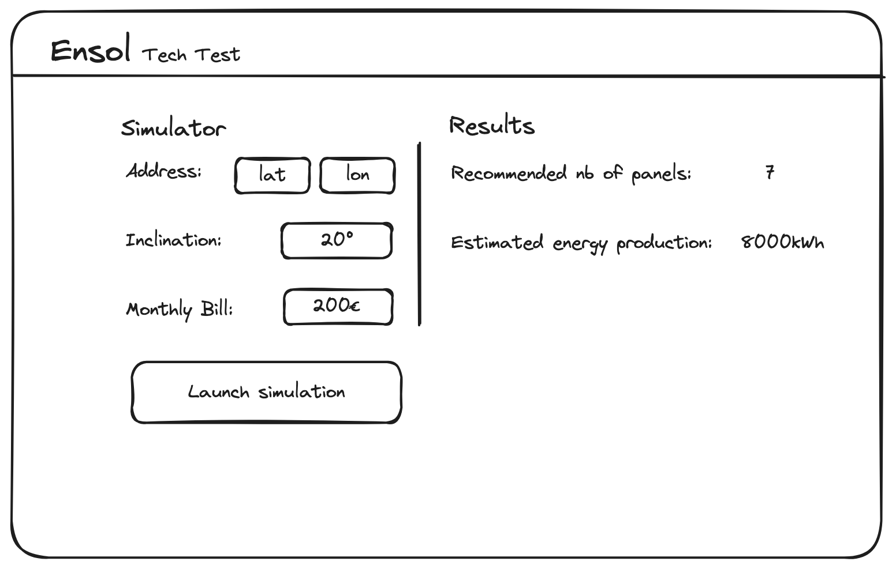

# Tech Interview

# Objectives

Using our [Google Sheet Simulator](https://docs.google.com/spreadsheets/d/1OuyYj-a0HMRwHSgAnYZcGLCyxeIifyBE7ED-5crvOxA/edit#gid=1467322676) and [Europe’s PVGIS API](https://joint-research-centre.ec.europa.eu/photovoltaic-geographical-information-system-pvgis/getting-started-pvgis/api-non-interactive-service_en), you will build a small React app (using Typescript) to estimate a solar installation size based on a few parameters.

In other words, you will reverse engineer the current simulator spreadsheet to understand the dimensioning formula and use manual inputs, constants from the GSheet & PVGIS API to get all the parameters needed to compute the result.

# Project setup

Before starting, you will need to installe NodeJS 18.12 or greater and Yarn.
If you have `nvm` installed (`brew install nvm` or [here](https://github.com/nvm-sh/nvm?tab=readme-ov-file#installing-and-updating)):

```
nvm install 18.12
nvm use 18.12
npm i -g yarn
```

You can install workspace dependencies by running : `yarn`

## Frontend

You should be able to run frontend on http://localhost:5173 by running:

```shell
cd ./packages/frontend
yarn dev
```

## Backend

You should be able to run backend on http://localhost:8000 by running:

```shell
cd ./packages/backend
yarn dev
```

# Instructions

## Installation size definition

- An installation size means defining the number of solar panels to install on a given roof
- We define a “correct installation size” when the solar panels yearly energy production matches **85%** the customer’s yearly energy consumption
- We will use the following material:
  - Panels: DualSun Flash 425 Shingle Black (power: 425Wc)
  - Inverters: Micro-Onduleur Enphase IQ8AC

## Parameters & desired output

### Program Inputs

- Customer’s address (expressed in GPS coordinates: lat/lon)
- Customer’s electricity monthly bill (€)
- Customer’s roof’s inclination (°) & orientation (cardinal point: W,SW,S,SE etc)

### Output

- The number of estimated panels
- The estimated yearly produced energy in kWh
- The estimated yearly savings in €

### UI

You can choose whatever UI layout you prefer, as long as the UI is neat and easy to navigate.
To achieve this, [Mantine](https://mantine.dev/) UI kit has been installed and ready to use.

If you don't know how to start, you can use the following layout as a starting point:


The form fields values should be validated before submitting with the following conditions :

- orientation : one of these values W,SW,S,SE
- inclination : between 0° and 90°
- monthly bill : a positive integer
- coordinates: : floats

### Backend

The computation of simulation results should happen in the HTTP resource GET /simulation. You may update this route and both its parameters and response types. You may also validate the parameters before using them.

## A few tips

The energy produced by a solar panel depends on multiple transformations:

- The sun energy irradiating the customer’s roof is called “irradiance”, measured in **kWh/m2/year**
  - The [PVGIS API](https://joint-research-centre.ec.europa.eu/photovoltaic-geographical-information-system-pvgis/getting-started-pvgis/api-non-interactive-service_en) will help you mesure this value for a given address
- The solar panels will receive this energy with a loss ratio, depending of:
  - The system efficiency
  - The photovoltaic panel efficiency
  - The roof’s inclination & orientation
- You can find useful information about efficiencies loss in "Energy Production" tab of the Google Sheet Simulator
